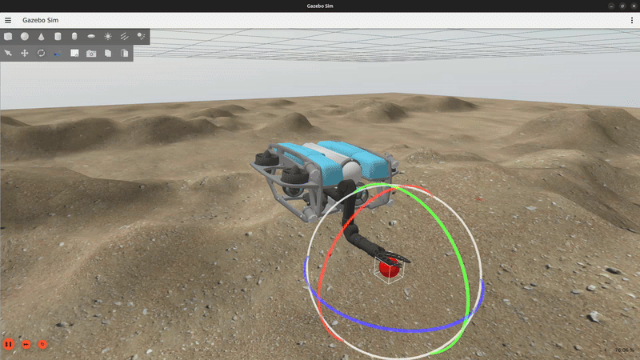

# auv_controllers

<p align="center">
  
  
</p>

auv_controllers is a collection of controllers for autonomous underwater
vehicles (AUVs) and underwater vehicle manipulator systems (UVMS) implemented
using ros2_control. The controllers have been designed to support the complete
system control hierarchy and to enable benchmarking against other commonly-used
control algorithms.

## Installation

auv_controllers is currently supported on Linux and is available for the ROS 2
Rolling and Jazzy distributions. To install auv_controllers, first clone this
project to the `src` directory of your ROS workspace:

```bash
git clone git@github.com:Robotic-Decision-Making-Lab/auv_controllers.git
```

After cloning the project, install all external dependencies using `vcs`:

```bash
vcs import src < src/auv_controllers/ros2.repos
```

Finally, install the ROS dependencies using `rosdep`:

```bash
rosdep update && \
rosdep install -y --from-paths src --ignore-src
```

## Getting started

To learn more about how to use the controllers provided in this project, please
refer to the [examples package](https://github.com/Robotic-Decision-Making-Lab/auv_controllers/tree/main/auv_control_demos).
You can also find integration tutorials in the [Blue documentation](https://robotic-decision-making-lab.github.io/blue/tutorials/control/).

## Getting help

If you have questions regarding usage of auv_controllers or regarding
contributing to this project, please ask a question on our [Discussions](https://github.com/Robotic-Decision-Making-Lab/auv_controllers/discussions) board!

## License

auv_controllers is released under the MIT license.
